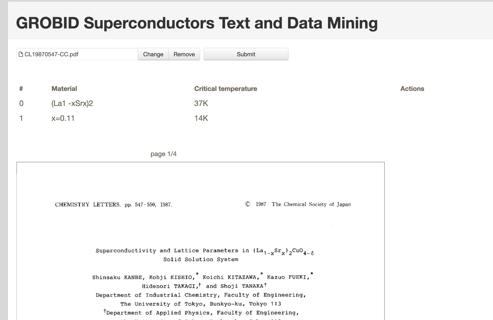

# grobid-superconductor-web
Advanced curation interface for [Grobid Superconductor](https://github.com/lfoppiano/grobid-superconductors).

**NOTE**: Grobid-superconductors ships already a basic interface, this adds several features and is relying on Grobid-superconductors only for data extraction. 

